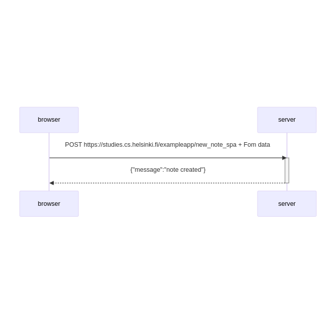

sequenceDiagram
    participant browser
    participant server
    
    browser->>server: POST https://studies.cs.helsinki.fi/exampleapp/new_note_spa + Fom data
    activate server
    server-->>browser: {"message":"note created"}
    deactivate server

